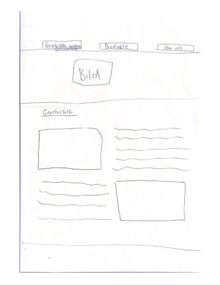
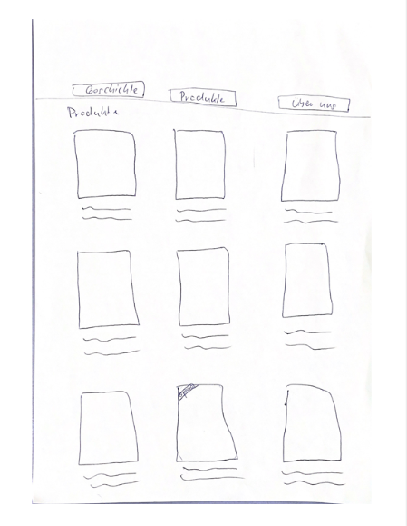
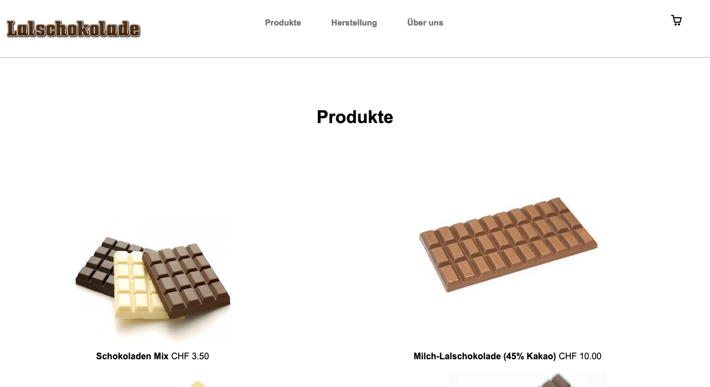
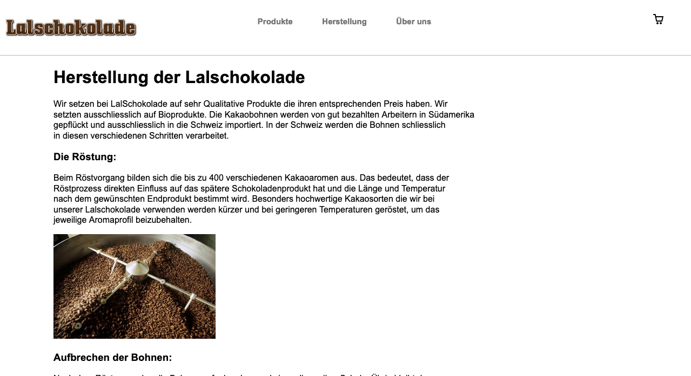
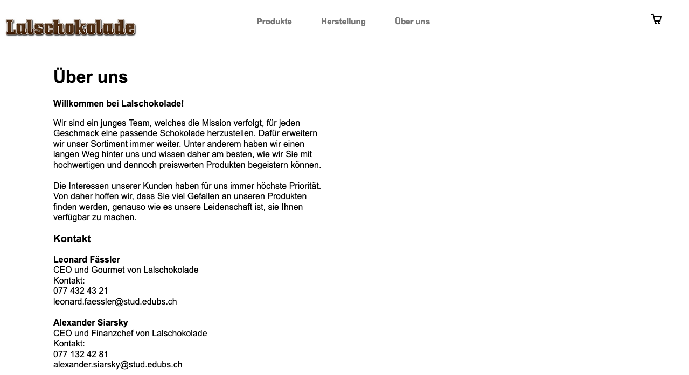

# Lalschokolade
Unsere Website präsentiert unsere eigene Schokoladenmarke Lalschokolade. Die Website hat drei verschiedene Seiten. In denen unsere Produkte, die Geschichte der Schokoladefirma und die Gründer der Marke vorgestellt werden.

## Projektplan

Die Funktionalität unserer Website sollte sein, dass die Hauptseite den Website Besuchern Vertrauen schenkt, sie sollten nachdem lesen der Seite etwas mehr über die Firma wissen. Unsere Unterseite mit den Produkten sollte die Besucher dazu anregen etwas von uns zu kaufen. Und unsere Über uns Seite sollte den Besuchern die Möglichkeit bieten uns Gründer zu kontaktieren um Fragen zu Beantworten.

### Hauptseite

Auf der Hauptseite wollten wird die Geschichte der Schokolade aufzeigen. In der stehen sollte wie/wann und wo die Firma entstanden ist.

### Unterseite 1

Auf der ersten Unterseite sollten unsere verschiedenen Schokoladen Produkte zu sehen sein. Die wir jeweils mit einem Bild und einem kurzen Text darstellen wollten.

### Impressum

In unserer zweiten Unterseite wollten wir ein „Über uns“ schreiben, dass gleichzeitig auch unser Impressum sein sollte. Dort sollten die Gründer der Firma mit ihren Kontaktdaten vorgestellt werden.

## Zeitplan

Um ehrlich zu sein haben wir das ganze Projekt inerhalb einer Woche umgesetzt. Für das Programmieren haben wir uns Privat zusammengesetzt und haben daran gearbeitet, darum ist alles auf meinem Namen eingereicht.Schlussendlich sind wir rechtzeitig mit dem Auftrag fertig geworden und sind zufrieden mit unserer Seite.

| Deadline | Name | Beschreibung |
| --- | --- | --- |
|25.05.2021  | Beide            | Ideen Sammeln |
|28.05.2021  | Beide            | Skizze der Webseite|
| 29.05.2021 | Leonard Fässler | Produkt Seite wird gemacht |
| 30.05.2021 | Alexander Siarsky | Herstellung's Seite wird gemacht|
| 30.05.2021 | Leonard Fässler | Über Uns Seite wird gemacht |
| 30.05.2021 | Alexander Siarsky | Header wird gemacht |
| 30.05.2021 | Alexander Siarsky | Footer wird gemacht |

## Umsetzung
Wenn man auf unsere Seite kommt dan gelangt man direkt zu der Produkt Seite. Oben über den Header kann man zu der Herstellungs Seite gelagen und weiter noch zu der Über uns seite. Bei der Herstellungs Seite beschreiben wir wie unsere Schokolade entsteht, bei der Über uns Seite beschreiben wir uns und noch wir die Kunden uns kontaktieren können.

Der Header beinhaltet auf der linken Seite das Logo unser Firma, dann in der Mitte befinden sich die verschiedenen Links zu den jeweiligen Seiten die wir noch weiter unten beschreiben. Und auf der rechten Seite befinden sich ein Warenkorb der aber noch nicht funktioniert.

Um den Header von dem Inhalt abzugrenzen haben wir einen Strich dazwischen gezogen.

Beim Footer haben wir uns simpel gehalten, da uns das so am besten gefällt. Dort ist nur das Copyright unserer Firma.

### Produktseite

Wenn man auf die Webseite kommt dann startet man auf der Produkt Seite, dort haben wir unsere Produkte aufgelistet. Diese könnte man theoretisch kaufen, diese Funktion haben wir aber noch nicht intergriert. Bei den Produkten sieht man die Namen der Produkte und den Preis den wir für das jeweilige Produkt verlangen. Unten sieht man ein Button für "Mehr Anzeigen", dieser funktioniert noch nicht, da wir noch keine weiteren Produkte hinzugefügt haben.

### Herstellungseite

Die Herstellungs Seite soll den Vorgang beschreiben der unsere Schokolade durch geht bevor es zu dem Endprodukt kommt. Diese Seite ist so aufgebaut, das immer ein wenig Text den Vorgang beschreibt und dannach kommt ein Bild welches das gesagte unterstüzt.

### Überunsseite 

Die Über Uns Seite ist in zwei Teile eingeteilt. Der erste Teil ist das Über uns in welchem wir mit einem Begrüssungs-Text unsere Firma beschreiben. Danach kommt der zweite Teil mit dem Kontakt, dort befinden sich unsere Kontakt Daten, welche die Kundern gerne benutzen dürfen um uns zu kontaktieren. Weiter unten ist noch ein zusätzliches Kontaktformular wo man seine Email und sein Anliegen beschreiben kann, dieses funktioniert momentan aber auch noch nicht.

## Zusammenfassung

Ursprünglich wollten wird auf der Website über die über die Geschichte der Firma schreiben. Da uns zu dieser nicht sehr viel eingefallen ist haben wir diese Seite durch die Herstellung der Schokolade ersetzt. 

Die Reihenfolge der Haupt- und Unterseiten ist auf der Skizze auch anders als auf der Website. Auf der Website haben wir uns schlussendlich entschieden die Produkte als Hauptseite zu nehmen die Herstellung als erste Unterseite und die Über uns Seite als zweite Unterseite. Bis auf diese zwei Dinge hat die Umsetzung unserer Seite sehr gut geklappt wir haben die Produkt- und Über uns Seite wie auf der Skizze umgesetzt, ausser bei der Über uns Seite, dort wollten wir ursprünglich noch Bilder von uns einfügen, da diese aber nicht in das gesammt Bild gepasst haben, haben wir sie wieder gelöscht.